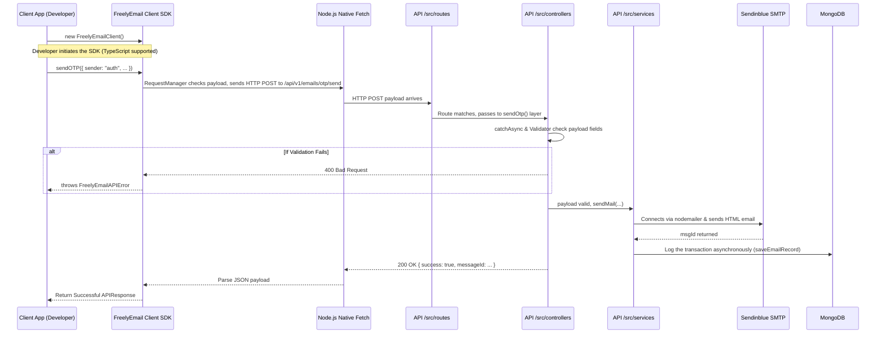

<div align="center">
  <h1>freelyEmail 🤖 ✉️ by Harshit</h1>
  <p>A simple, powerful, and scalable email-sending SDK native for Node.js, built with ❤️ by <strong>Harshit Keshari (<a href="https://github.com/Harshit107">Harshit107</a>)</strong>. Connects effortlessly to the <a href="https://github.com/Harshit107/FreelyEmail-API">FreelyEmail-API</a>.</p>
</div>


**Version Requirement**: Node.js `>= 18.0.0` (Uses native fetch, 0 dependencies).

## ✨ Architecture Flow Diagram



## 🚀 Features
- **Created by Harshit**: Maintainable open-source library explicitly crafted by Harshit107.
- **Object-Oriented Design**: Instantiate the `FreelyEmailClient` and go.
- **Robust Error Handling**: Distinct Custom Errors (`FreelyEmailAPIError`) for robust backend integrations.
- **TypeScript Support**: Full code-completion and Type definitions included out-of-the-box.
- **No Dependencies**: Relies completely on native Node.js fetch APIs!

---

## 📥 Installation

```bash
npm install freely-email
```

---

## 🛠 Basic Setup

Import and initialize the client. You can optionally pass a custom `baseURL` if you host the associated API yourself.

```javascript
const { FreelyEmailClient } = require("freely-email");

// Default public API
const emailClient = new FreelyEmailClient(); 

// OR Custom Private API Server
// const emailClient = new FreelyEmailClient({ baseURL: "https://my-custom-email-api.com/api/v1/emails/" });
```

---

## 📖 Usage Examples

### 1. Send Normal Notification Email 📝
Send a customized email with optional HTML attachments.

```javascript
async function notifyUser() {
  try {
    const response = await emailClient.sendEmail({
      sender: "support-bot",
      recipient: "user@example.com",
      replyTo: "support@example.com",
      app: "My Demo App",
      subject: "Welcome Aboard!",
      message: "This is a plain text message fallback.",
      HTMLfile: "<html><body><h1>Welcome to My Demo App</h1></body></html>"
    });
    console.log("Success:", response.data.messageId);
  } catch (error) {
    console.error("Failed to send email:", error.message);
  }
}
notifyUser();
```

### 2. Request OTP (Auto-Generated) 🔐
Ask the API to securely generate a 6-digit OTP and email it to the user with a beautiful, modern HTML template.

```javascript
async function requestOTP() {
  const result = await emailClient.requestOTP({
    sender: "Example Auth",
    recipient: "user@example.com",
    app: "Demo App",
    subject: "Your Login Code",
    withValidTime: 10 // Validity displayed as 10 minutes in the UI
  });
  console.log("OTP Sent!", result.data.messageId, result.data.otp);
}
```

### 3. Send Check Health 🩺
Ping the backend server to ensure the email API is online.

```javascript
emailClient.checkHealth()
  .then(res => console.log(res.message))
  .catch(err => console.error("API is down:", err));
```

---

## 🛡️ Error Handling
The SDK exposes two custom error classes for clean `try/catch` checks:
- `FreelyEmailAPIError`: HTTP issues (e.g., 400 Bad Request if missing fields, 500 API Crash).
- `FreelyEmailValidationError`: SDK-side malformed input errors.

```javascript
const { FreelyEmailClient, FreelyEmailAPIError } = require("freely-email");

try {
  await emailClient.sendEmail({...});
} catch (err) {
  if (err instanceof FreelyEmailAPIError) {
    console.log("API Status Code:", err.status);
    console.log("Details:", err.details);
  }
}
```
